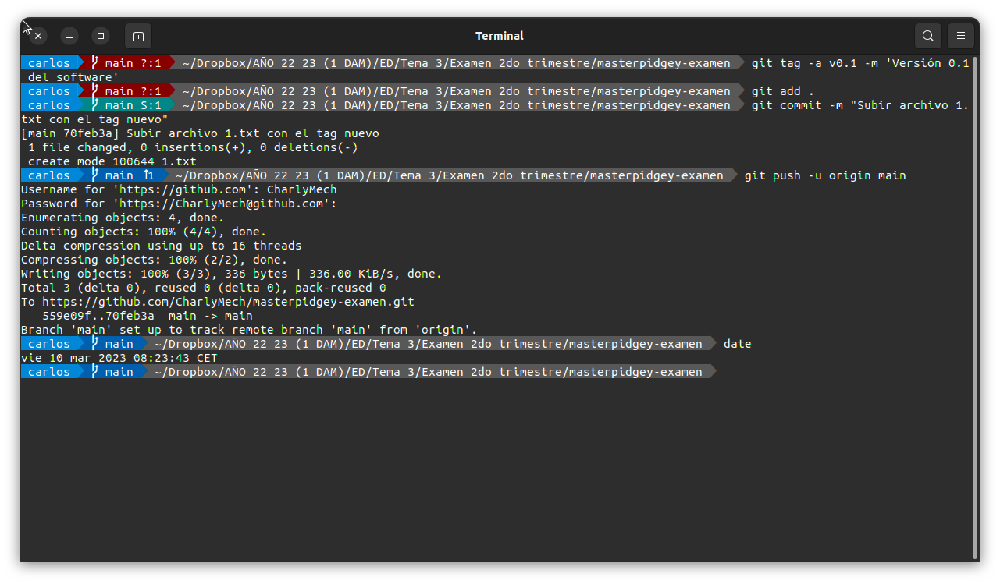

# Examen Segundo Trimestre - Entornos de Desarrollo

## Parte 1

### Crear repositorio

Para crear un repositorio en nuestro perfil de GitHub, se accede primeramente al panel de repositorio de nuestro perfil y se selecciona "Nuevo" arriba a la derecha en azul. Para este caso no es necesario crear un README.md como permite hacer cuando se configura el nombre del nuevo repositorio.


### Clonar repositorio y añadir cambios

Una vez creado, clonamos el repositorio localmente mediante el comando `git clone [url]` y el enlace al repositorio.

```bash
	$ git clone https://github.com/CharlyMech/masterpidgey-examen.git
```

Cuando está creado, es momento de añadir el archivo README.md al repositorio y subirlo. Para ello se ejecutamos los comandos de la siguiente imagen.


### Ignorar archivos y carpetas

En caso de que queramos ignorar archivos en el repositorio local, necesitamos crear el archivo `.gitignore` y añadirle las sentencias necesarias.

```bash
	$ touch/nano .gitignore
```


### Tag v0.1

Un tag sirve como comentario extra además del `commit`, como por ejemplo la versión del software que se está modificando.

Para crear un tag ejecutamos los siguientes comandos (es necesario realizar un cambio en un archivo del repositorio para actualizar los cambios).

```bash
	$ git tag -a v0.1 -m 'Versión 0.1 del software'
```





### Crear una tabla

| NOMBRE | GITHUB |
| --- | --- |
| Máximo Fernández Riera | [Enlace al GitHub del profesor](http://github.com/maximofernandezriera) |


### Añadir al profesor como colaborador

Para añadir a una persona como colaboradora de un repositorio hay que acceder a la configuración de éste e ir al apartado de "Colaboradores" de las opciones de la derecha. Introducimos el nombre del nuevo colaborador y se acepta.


## Parte 2

El primer paso sería crear una bifurcación del repositorio dado por el enunciado. Para ello seleccionamos la opción de arriba a la derecha, al lado de la estrella.


Una vez bifurcado, necesitamos clonarlo localmente, tal y como se vió anteriormente. Una vez clonado creamos una rama nueva para realizar los cambios.


Desde la nueva rama realizamos algún cambio. Para que no haya conflictos con el resto de los compañeros, decido crear un archivo nuevo con mi nombre. Añadimos los cambios al área de staging, ejecutamos el `commit` y subimos los cambios.

```bash
	$ git branch [nombre]
	$ git checkout [nombre]
```


El siguiente paso es añadir el repositorio remoto, para ello ejecutamos los siguientes comandos.

```bash
	$ git remote add [nombre_subir] [repo original]
	$ git remote -v
	$ git fetch [nombre]
```


El último paso desde la terminal sería ejecutar el `merge`.

```bash
	$ git checkout main
	$ git merge [nombre_subir]/main
```

Tras este paso, si nos vamos al repositorio original podemos ver que aparece un mensaje para crear la nueva pull request.


Tras este paso queda esperar que se acepten los cambios para verlos en el repositorio.


